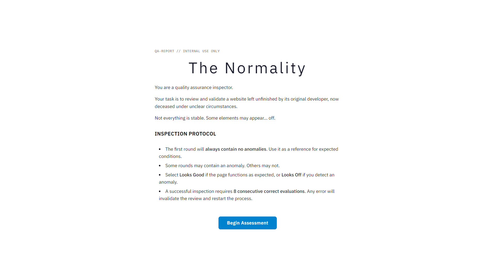
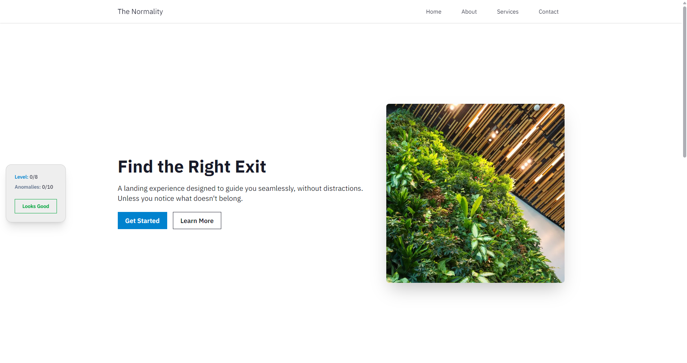
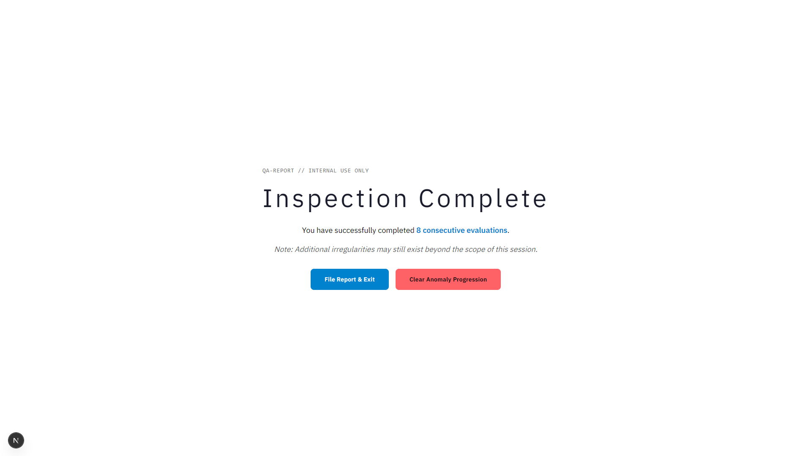

# The Normality

**A web-based anomaly detection game that tests perception and attention to detail.**

---

## Overview

_The Normality_ is a game where players act as a QA inspector tasked with reviewing a website left unfinished by its deceased developer. The game mixes suspense, corporate aesthetics, and attention-focused gameplay.

Players must detect anomalies in the website layout while following inspection protocols. Winning requires careful observation and consecutive correct evaluations.

## Table of Contents

- [Overview](#overview)
- [Gameplay](#gameplay)
- [Screenshots](#screenshots)
- [Technologies](#technologies)
- [Installation](#installation)
- [Project Structure](#project-structure)
- [Contributing](#contributing)
- [License](#license)

## Gameplay

- Start as a QA inspector reviewing a website.
- The first round contains no anomalies for reference.
- Click **Looks Good** if the page seems normal.
- Click **Looks Off** if you detect an anomaly.
- Winning conditions:
  - Complete **8 consecutive correct evaluations**, OR
  - Discover **all known anomalies**.

After the end screen, players can:

- **File Report & Exit:** keep progress toward all anomalies
- **Clear Anomaly Progression:** reset all progress

## Screenshots

### Introductory Page



### Gameplay Example



### End Screen



## Technologies

- **Frontend:** Next.js, React, Tailwind CSS, daisyUI
- **State Management:** Zustand
- **Animations:** Framer Motion
- **Deployment:** Vercel

## Installation

1. Clone the repository:

```bash
git clone https://github.com/KarimChehab2003/the-normality.git
```

2. Install dependencies:

```bash
npm install
```

3. Start the development server:

```bash
npm run dev
```

4. Open http://localhost:3000 in your browser.

## Project Structure

```text
/app
  /end
    /components
      button-group.tsx
      exit-button.tsx
      outcome-text.tsx
      page.tsx
  /game
    /components
      anomaly-injector.tsx
      game-dock.tsx
      hero-image.tsx
      landing-page.tsx
      page-transition.tsx
      page.tsx
  /lib
    anomalies.ts
    utils.ts
  /screenshots
    intro-page.png
    gameplay.png
    end-screen.png
  /store
    game-store.ts
/public
  hero-image.jpg
  hero-image-glitched.jpg
  avatar1.jpg
  avatar2.jpg
  ...other assets
```

## Contributing

1. Fork the repository
2. Create a new branch (`git checkout -b feature-name`)
3. Make your changes
4. Commit (`git commit -m "Add feature"`)
5. Push (`git push origin feature-name`)
6. Open a pull request

## License

This project is licensed under the MIT License.
